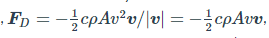
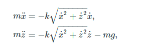
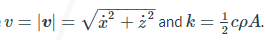
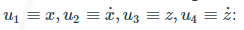
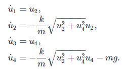

## Сферический объект с сопротивлением воздуха

Сферический объект массой m запущенный с некоторой начальной скоростью движется под воздействием двух сил: Гравитации И сопротивления воздуха (тяги)  направленной противоположно скорости объекта и пропроциональной квадрату этой скорости.
Здесь С это коэффицент тяги, p это плотность воздуха и А это площадь поперечного сечения объекта

т.о. выводятся уравнения

Где . Это может быть разложено на следующие дифуры с

Приложенный код интегрирует данную систему и определяет два события: попадание по цели ( объект касается земли при Z=0) и достижение максимальной высоты (там где скорость по Z = 0). Мы добавляем атрибут `hit_target.direction = -1` чтобы удостовериться что `hit_target` срабатывает только когда его возвращаемое значение меняется с положительного на отрицательное, в другом случае событие будет воспроизведено при запуске т.к Z0 = 0. Другие возможные события это `direction = 1` : вызывает событие когда возвращаем значение меняется с отрицательного на положительное или `direction=0` (стандартное) : событие воспроизводится когда возвращаемое значение 0 с любой из
